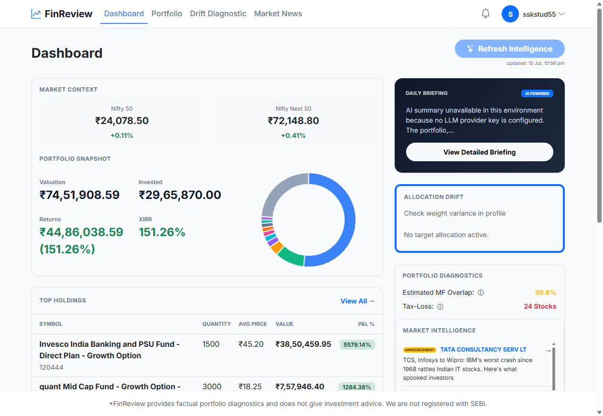
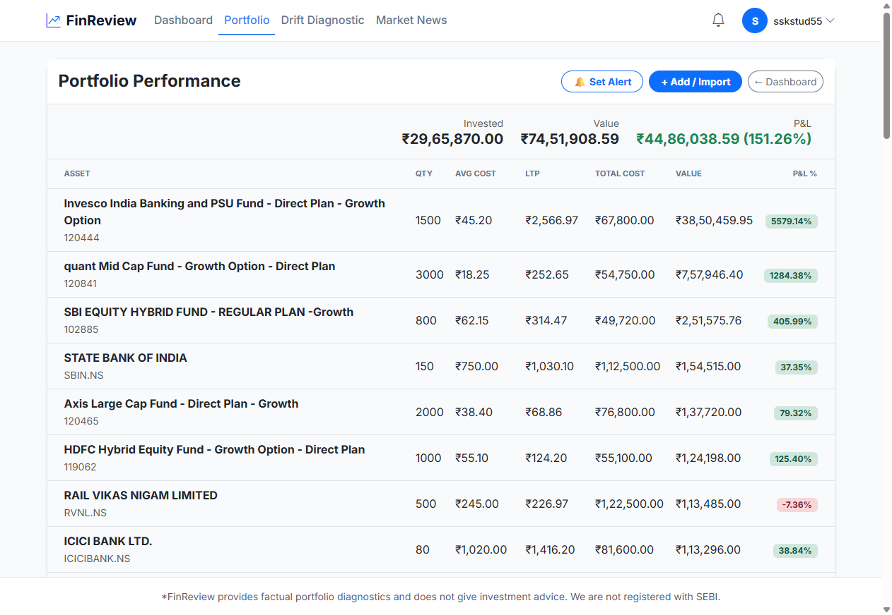
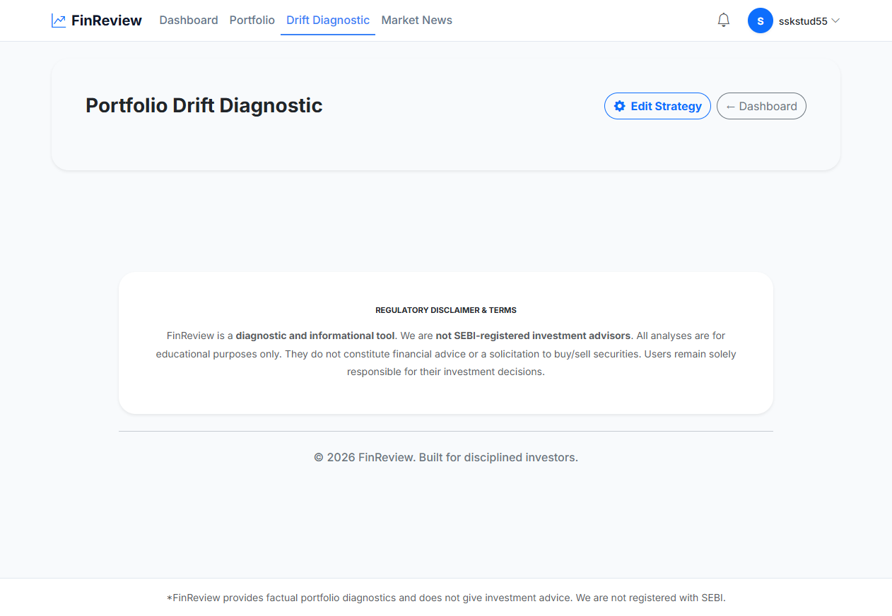
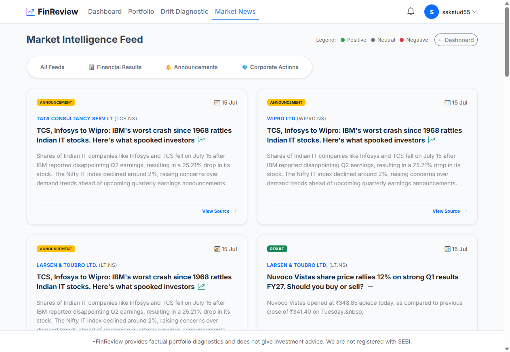
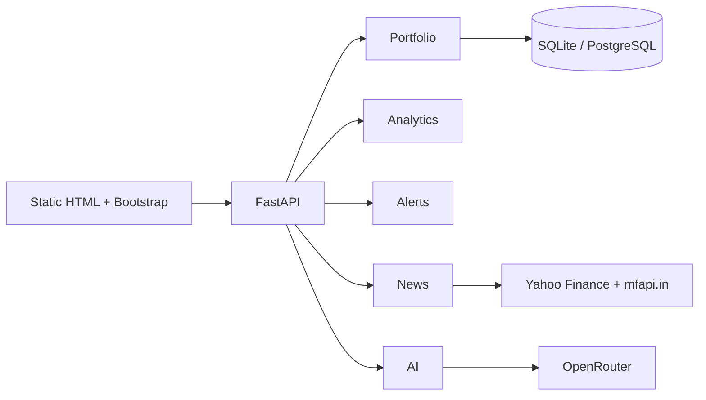

# FinReview

> **AI-Assisted Portfolio Intelligence Platform for Indian Investors**


FinReview is an open-source **Community Edition** portfolio intelligence platform designed to demonstrate modern backend architecture, financial analytics, and responsible AI integration.

Unlike traditional portfolio trackers that primarily record transactions, FinReview focuses on helping investors understand **what their portfolio is doing** through deterministic financial analytics complemented by AI-assisted portfolio briefings.

This project is published as a **software engineering showcase**, demonstrating backend engineering, solution architecture, REST API design, financial domain modelling, and AI integration.

---

# 🌐 Live Demo

**Application**

https://projects.sathishkannan.com/finreview

---

# Why FinReview?

Most portfolio trackers focus on recording transactions.

FinReview focuses on helping investors understand **what their portfolio is doing** by combining deterministic financial analytics with AI-assisted portfolio intelligence.

The project was intentionally designed using a **Static Frontend + FastAPI Backend** architecture to demonstrate scalable backend engineering, clean API design, and responsible AI integration while remaining simple to deploy on low-cost infrastructure.

Rather than relying on AI for financial calculations, FinReview keeps all portfolio analytics deterministic and uses AI only to:

- Explain portfolio behaviour
- Summarise market developments
- Highlight portfolio observations
- Generate informational briefings

This separation improves reliability, transparency, and testability while demonstrating responsible AI integration.

---

# 📸 Screenshots

## Dashboard



---

## Portfolio



---

## Drift Diagnostic



---

## Market News



---

# ✨ Features

## Portfolio Management

- User registration & authentication
- Indian Stocks and Mutual Funds
- Manual BUY / SELL transactions
- CSV transaction import
- Sample portfolio onboarding
- Portfolio valuation
- Holdings management
- User profile management

---

## Portfolio Analytics

- Portfolio valuation
- Invested cost tracking
- Gain/Loss analysis
- XIRR calculation
- Concentration analysis
- Allocation drift diagnostics
- Tax-loss opportunity diagnostics
- Estimated mutual fund overlap analysis

---

## Alerts & Market Intelligence

- Price Above alerts
- Price Below alerts
- Portfolio value alerts
- Allocation drift alerts
- Market news aggregation
- News sentiment analysis
- Nifty market context

---

## AI-Assisted Briefings

- Portfolio summaries
- Risk observations
- Portfolio explanation
- OpenRouter integration
- Graceful fallback when AI is unavailable

---

# 🏗 Design Principles

FinReview was intentionally designed around a few core engineering principles.

### Deterministic Before AI

Financial calculations are performed using deterministic algorithms.

AI is used only to explain results—not generate them.

---

### Backend-First Architecture

Business logic resides entirely within the FastAPI backend while the frontend remains lightweight, framework-independent, and deployment-friendly.

---

### Responsible AI Integration

AI-generated content is clearly identified as informational and is never presented as investment advice.

---

### Deployment Simplicity

The application is intentionally designed to run using a static frontend and independently hosted backend, making deployment straightforward on low-cost infrastructure.

---

### Open Architecture

The Community Edition exposes the complete application architecture without artificial feature restrictions, making it suitable for learning, evaluation, and portfolio review.

---

# 🏛 Architecture



Additional documentation:

- docs/architecture.md
- docs/api.md
- docs/database.md

---

# ⚙ Technology Stack

| Layer | Technology |
|---------|------------|
| Backend | Python 3.11, FastAPI, SQLModel |
| Frontend | HTML5, Bootstrap 5, Vanilla JavaScript |
| Database | SQLite (Development), PostgreSQL (Production) |
| Charts | Chart.js |
| AI | OpenRouter |
| Market Data | Yahoo Finance & mfapi.in |
| Deployment | Render + Static Hosting |

---

# 📂 Repository Structure

```text
backend/
    FastAPI backend

frontend/
    Static HTML, CSS & JavaScript

docs/
    Technical documentation

tests/
    Backend regression tests

scripts/
    Utility scripts

Dockerfile

docker-compose.yml

render.yaml
```

---

# 🚀 Quick Start

## Backend

```bash
cd backend

python -m venv .venv

pip install -r requirements.txt

copy ..\.env.example .env

uvicorn main:app --reload
```

Backend

```
http://localhost:8000
```

---

## Frontend

```bash
cd frontend

python -m http.server 8080
```

Frontend

```
http://localhost:8080
```

---

# 🐳 Docker

```bash
copy .env.example .env

docker compose up --build
```

---

# ☁ Deployment

Recommended deployment architecture

| Component | Platform |
|-----------|----------|
| Frontend | Static Hosting (MilesWeb) |
| Backend | Render |
| Database | PostgreSQL |
| AI | OpenRouter |

---

# 🔐 Configuration

Important environment variables

```
DATABASE_URL

AUTH_SECRET_KEY

OPENROUTER_API_KEY

CORS_ALLOW_ORIGINS

LOG_LEVEL
```

Refer to:

```
.env.example
```

---

# 🛡 Security

- Open-source Community Edition
- Informational only — not investment advice
- Lightweight HMAC-signed bearer authentication
- SQLite for development
- PostgreSQL recommended for hosted deployments
- Secrets managed using environment variables

---

# 🎯 Engineering Objectives

FinReview was built to demonstrate practical software engineering across multiple disciplines:

- Solution Architecture
- Backend Engineering
- REST API Design
- Financial Domain Modelling
- AI Integration
- Authentication & Security
- Database Design
- Deployment Architecture
- Production-style Engineering Practices
- Technical Documentation

---

# 📚 Documentation

Additional technical documentation is available under the **docs/** directory.

- Architecture
- API
- Database
- Deployment

---

# 🗺 Roadmap

See:

```
ROADMAP.md
```

---

# 🤝 Contributing

Please refer to:

- CONTRIBUTING.md
- CODE_OF_CONDUCT.md

---

# 📄 License

MIT License

---

# 👨‍💻 Author

**Sathish Kannan**

Backend Engineer • AI Integration • Solution Architecture • Financial Technology

🌐 Portfolio  
https://sathishkannan.com

🚀 Live Demo  
https://projects.sathishkannan.com/finreview

💻 GitHub  
https://github.com/sathishkannan-sakthivel

💼 LinkedIn  
https://www.linkedin.com/in/ssathishkannan