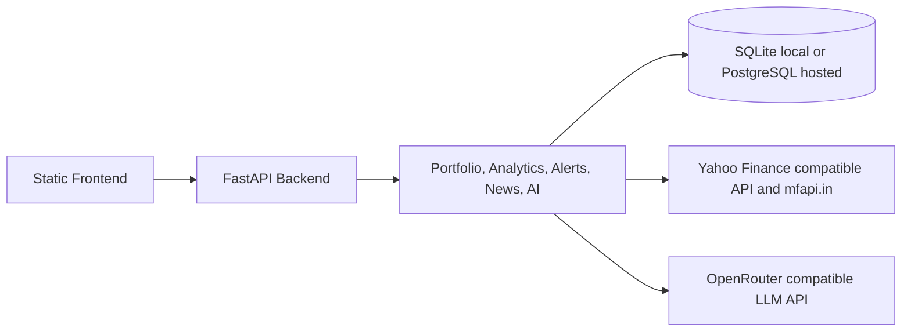

# FinReview Community Edition

FinReview is a self-hostable portfolio intelligence application for Indian market investors. It combines portfolio tracking, transaction import, market data refreshes, analytics, alerts, market news, and AI-generated informational briefings in a FastAPI plus static frontend architecture.

The v1.0.0 Community Edition removes paid-tier gating: all portfolio intelligence features are available to registered users. It is intended for local development, Docker evaluation, GitHub portfolio review, and a practical public deployment with a hosted backend and static frontend.

## Current Feature Set

### Portfolio Management

- Email/password signup and login with bcrypt password hashing.
- User profile fields for name, year of birth, city, state, target allocation, and drift sensitivity.
- Indian equity and mutual fund holdings using NSE/BSE-style symbols and AMFI mutual fund codes.
- Manual BUY/SELL transaction entry.
- Bulk CSV transaction import.
- CAS PDF parser boundary is present, but PDF import is disabled in v1.0.0; use CSV import or manual entry.
- Optional sample portfolio onboarding for first-run exploration.
- Empty-state dashboard actions for add transaction, CSV import, and sample portfolio loading.

### Analytics and Diagnostics

- Portfolio valuation, invested cost, gain/loss, and holding-level P&L.
- XIRR calculation from transaction cash flows.
- Concentration analysis using individual holding and top-holding exposure.
- Target allocation drift analysis based on saved user allocation preferences.
- Tax-loss candidate diagnostic based on holdings trading below cost.
- Estimated mutual fund overlap diagnostic preview; real fund look-through data integration is planned.
- Drift diagnostic view for allocation variance review.

### Alerts and Market Intelligence

- Price-above and price-below alert rules.
- Portfolio valuation-below alerts.
- Allocation drift alerts from explicit rules and saved target allocations.
- Alert event feed with warning and critical severity levels.
- Portfolio-related market news ingestion.
- News categories for general news, financial results, announcements, and corporate actions.
- Lightweight keyword-based news sentiment indicator where available.
- Nifty market context endpoint.

### AI Briefings

- OpenRouter-compatible AI briefing service.
- Structured insight types for portfolio briefing, risk alert, and change explanation.
- Graceful fallback behavior when no AI provider key is configured.
- AI output is informational only and is not investment advice.

### Frontend Experience

- Static HTML, CSS, and vanilla JavaScript frontend.
- Bootstrap 5 and Bootstrap Icons UI.
- Chart.js dashboard visualizations.
- Dashboard, full portfolio table, drift diagnostic page, market news page, profile panel, alert modal, transaction modal, CSV import, and AI briefing modal.
- Runtime backend API configuration through `window.FINREVIEW_API_URL`, including a PHP runtime config example for shared hosting.
- No frontend build step required.

## Architecture



Detailed architecture diagrams are in [docs/architecture.md](docs/architecture.md), including system architecture, portfolio intelligence flow, AI briefing flow, and deployment topology. API notes are in [docs/api.md](docs/api.md), and schema notes are in [docs/database.md](docs/database.md).

## Technology Stack

- Backend: Python 3.11, FastAPI, SQLModel, SQLAlchemy, Uvicorn.
- Database: SQLite for local development, PostgreSQL for hosted deployment.
- Frontend: HTML, vanilla JavaScript, Bootstrap 5, Bootstrap Icons, Chart.js.
- AI: OpenRouter-compatible chat completion endpoint.
- Market data: Yahoo Finance-compatible chart API and mfapi.in.
- Deployment targets: Render for the backend and static/PHP shared hosting such as MilesWeb for the frontend.

## Repository Layout

```text
backend/                 FastAPI app, services, models, repositories, providers
frontend/                Static browser UI and runtime config example
docs/                    Architecture, API, and database notes
scripts/                 Utility scripts such as sample data seeding
tests/                   Backend-focused regression tests
render.yaml              Render backend blueprint
docker-compose.yml       Local full-stack evaluation
Dockerfile               Backend container image
.env.example             Local environment template
```

## Quick Start

### Backend

```bash
cd backend
python -m venv .venv
.venv\Scripts\activate
pip install -r requirements.txt
copy ..\.env.example .env
uvicorn main:app --reload
```

Open API docs at `http://localhost:8000/docs`.

### Frontend

```bash
cd frontend
python -m http.server 8080
```

Open `http://localhost:8080`.

The local frontend defaults to `http://localhost:8000` for the backend API.

## Docker Evaluation

```bash
copy .env.example .env
docker compose up --build
```

- Frontend: `http://localhost:8080`
- Backend: `http://localhost:8000`
- API docs: `http://localhost:8000/docs`

## Configuration

| Variable | Required | Purpose |
| --- | --- | --- |
| `DATABASE_URL` | Hosted yes, local no | SQLModel database URL. Defaults to local SQLite when omitted. Use PostgreSQL for hosted deployment. |
| `CORS_ALLOW_ORIGINS` | Hosted yes, local no | Comma-separated frontend origins allowed to call the API. |
| `AUTH_SECRET_KEY` | Hosted yes, local no | Random secret used to sign lightweight bearer tokens. |
| `OPENROUTER_API_KEY` | No | Enables live AI briefing generation. |
| `AI_MODEL_ENDPOINT` | No | Chat completions endpoint. |
| `AI_MODEL_NAME` | No | Model name sent to the provider. |
| `NEWS_API_KEY` | No | Optional NewsData.io fallback key. |
| `MARKET_DATA_API_KEY` | No | Reserved for alternate market data providers. |
| `LOG_LEVEL` | No | Python logging level. |

Do not commit `.env`, local databases, API keys, database URLs, or deployment secrets.

## Frontend Runtime API URL

Browser JavaScript must know the public API origin, so the backend URL is configuration rather than a secret. For shared hosting, keep the real value out of Git by copying:

```text
frontend/config.runtime.example.php
```

to:

```text
frontend/config.runtime.php
```

Then set `FINREVIEW_API_URL` in the hosting environment and include this before `config.js` in the hosted `index.html`:

```html
<script src="config.runtime.php"></script>
```

`frontend/config.runtime.php` is ignored by Git.

## Sample Portfolio

New users start with an empty portfolio. The dashboard offers onboarding actions to add transactions, import CSV, or load the optional sample portfolio. The sample uses [sample_portfolio.csv](sample_portfolio.csv) and can be loaded through the UI or `POST /sample-portfolio/{user_id}`.

## Testing

```bash
pip install -r backend/requirements.txt
pip install -r requirements-dev.txt
pytest -q tests
python -m py_compile backend/main.py backend/config/settings.py
node --check frontend/config.js
node --check frontend/app.js
node --check frontend/auth.js
node --check frontend/ui.js
```

## Deployment

Recommended portfolio deployment:

- Backend: Render Web Service using `backend/` as the root directory.
- Database: PostgreSQL through Render, Supabase, Aiven, or another managed provider.
- Frontend: MilesWeb or similar shared hosting serving the static frontend files.
- API origin: a custom subdomain such as `api.yourdomain.com` pointing to the hosted backend.

See [DEPLOYMENT.md](DEPLOYMENT.md) for exact Render and MilesWeb steps.

## Security and Compliance Notes

- FinReview is an educational portfolio project and does not provide investment advice.
- The app is not registered with SEBI.
- Authentication uses a lightweight signed bearer token with user ownership checks; full JWT/session rotation hardening is a recommended next step.
- SQLite is suitable for local development, but hosted deployments should use PostgreSQL.
- CAS PDF import is disabled in v1.0.0. A production parser and secure file-handling path should be added before handling sensitive real statements.
- Keep provider keys, database credentials, and environment files outside GitHub.

## Screenshots

Screenshots are planned before the final portfolio showcase. Recommended captures: dashboard, portfolio table, transaction import modal, drift diagnostic page, market news page, and AI briefing modal.

## Roadmap

See [ROADMAP.md](ROADMAP.md).

## Contributing

See [CONTRIBUTING.md](CONTRIBUTING.md) and [CODE_OF_CONDUCT.md](CODE_OF_CONDUCT.md).

## License

MIT. See [LICENSE](LICENSE).