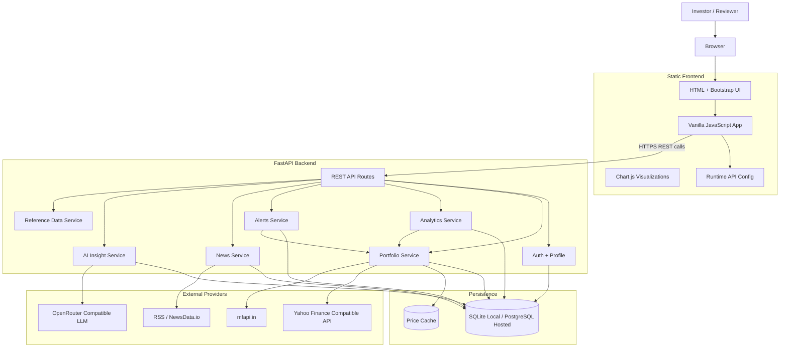
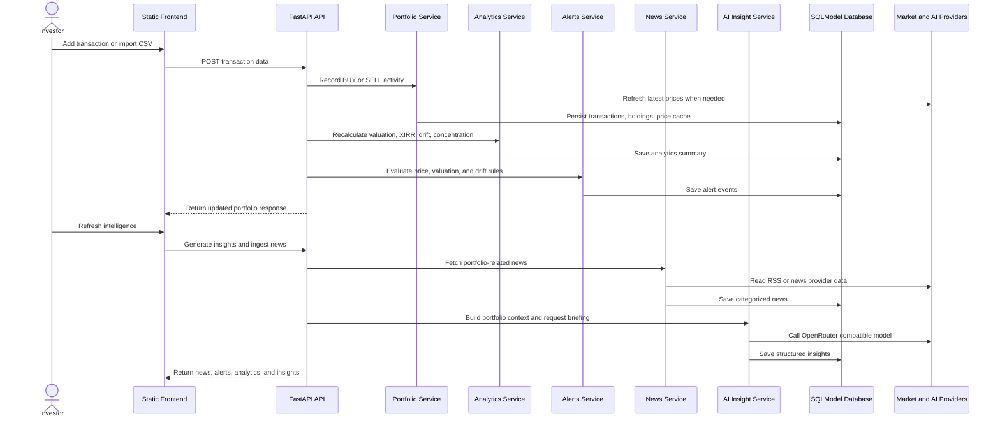
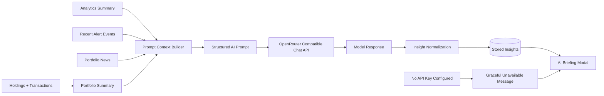
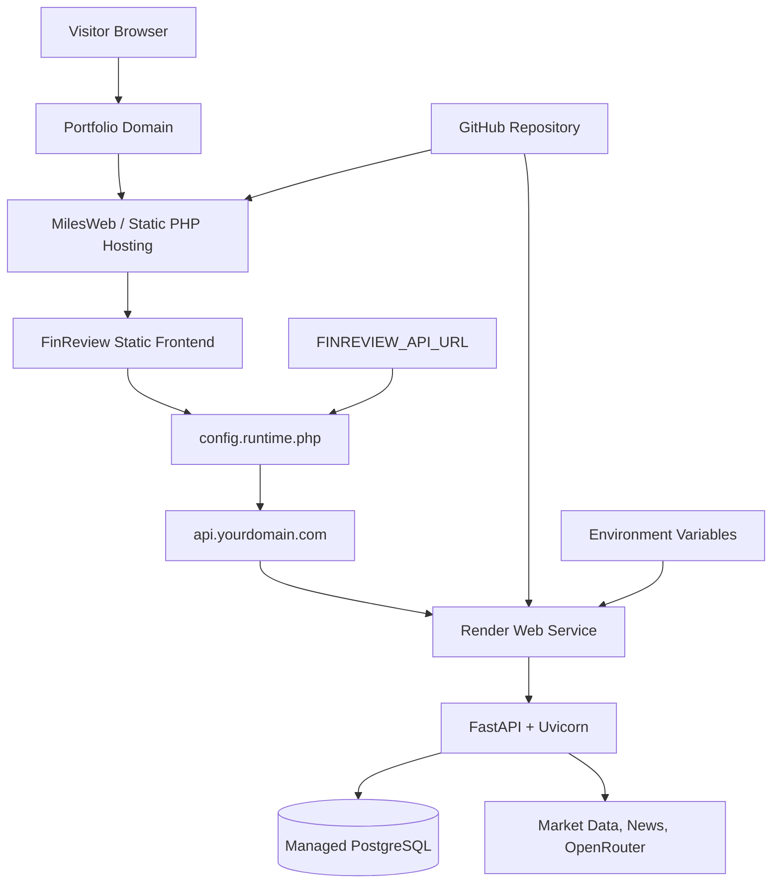

# FinReview Architecture

FinReview Community Edition is a self-hostable, AI-powered portfolio intelligence platform for Indian investors. The application uses a static browser frontend, a FastAPI backend, SQLModel persistence, market data provider integrations, news ingestion, alert evaluation, and optional OpenRouter-compatible AI briefings.

## 1. System Architecture

## 2. Portfolio Intelligence Flow

## 3. AI Briefing Flow

## 4. Deployment Topology

## Runtime Components

- `frontend/`: Static single-page application. It handles auth screens, dashboard, portfolio views, charts, transaction forms, alerts, market news, AI briefing display, and onboarding empty states.
- `frontend/config.runtime.example.php`: Optional shared-hosting runtime config pattern for injecting the public backend API origin without committing the real URL.
- `backend/main.py`: FastAPI application entrypoint, CORS setup, startup database initialization, and REST route composition.
- `backend/models/portable_models.py`: SQLModel schema for users, holdings, transactions, analytics, news, alerts, insights, and price cache.
- `backend/services/`: Portfolio, price, reference data, CAS parser boundary, and estimated overlap services.
- `backend/analytics/`: XIRR, concentration, allocation drift, and tax-loss diagnostics.
- `backend/ai/`: AI insight generation and provider calls.
- `backend/news/`: Market news ingestion, categorization, and sentiment enrichment.
- `backend/alerts/`: Portfolio, price, valuation, and allocation drift alert evaluation.

## Data Flow

1. A user registers or logs in through the static frontend.
2. The user imports CSV rows, loads the sample portfolio, or enters transactions manually.
3. Portfolio services persist transactions, update holdings, and refresh price metadata.
4. Analytics services calculate valuation, cost, XIRR, concentration, drift, estimated overlap preview, and tax-loss diagnostics.
5. Alert services evaluate explicit alert rules and target-allocation drift.
6. News services ingest portfolio-related market updates.
7. AI services generate informational summaries from portfolio context, analytics, alerts, and news when an AI provider key is configured.
8. The frontend renders charts, tables, diagnostics, alerts, news, AI insights, and empty states.

## Deployment Shape

- Local development can use SQLite and the Python static file server.
- Hosted backend deployments should use PostgreSQL because Render filesystem storage is ephemeral.
- The frontend is static and can be served by MilesWeb, any PHP-capable shared host, or any static host.
- A custom API subdomain such as `api.yourdomain.com` can point to Render so the public frontend does not expose the raw Render service URL.
- Secrets live in environment variables; the public API origin is runtime configuration, not a secret.