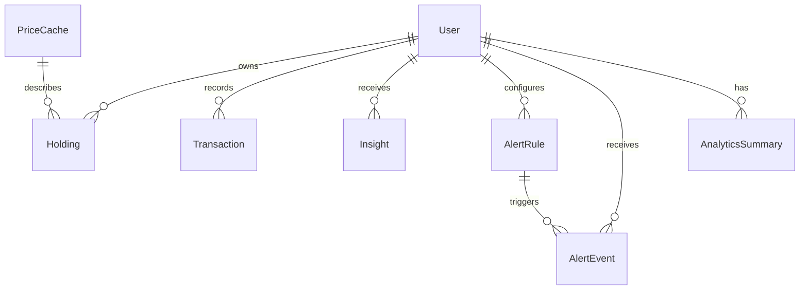

# Database Schema

FinReview uses SQLModel on top of SQLAlchemy. SQLite is supported for local development; PostgreSQL is recommended for deployment.

## Core Tables

- `user`: Account, profile, target allocation, drift sensitivity, and refresh metadata.
- `holding`: Current quantity and average cost per user and symbol.
- `transaction`: Buy/sell ledger with idempotency hash.
- `analyticssummary`: Valuation, cost, XIRR, concentration, and JSON diagnostics.
- `insight`: AI-generated and logic-generated insight records.
- `newsarticle`: Market news with category and sentiment.
- `alertrule`: User-defined alert rules.
- `alertevent`: Alert evaluation results.
- `pricecache`: Latest known price and display name by symbol.
- `newshash`: News de-duplication hashes.